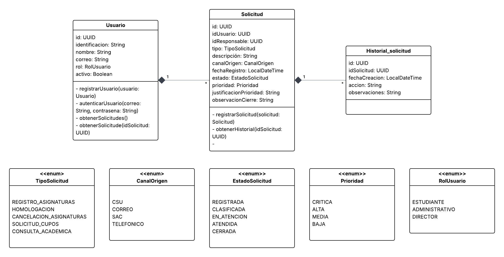

# Sistema de Triage y Gestión de Solicitudes Académicas                                                                                                                                           
API REST para la gestión del ciclo de vida de solicitudes académicas del Programa de Ingeniería de Sistemas y Computación.                                                                        
## Tabla de contenidos                                                                                                                                                                      
- [Contexto](#contexto)                                                                                            
- [Arquitectura y modelo de dominio](#arquitectura-y-modelo-de-dominio)                                                                               
- [Contratos API](#contratos-api)                                                                           
- [Equipo](#equipo)                                                                                                                                                                               
## Contexto                                                                                                                                    
El Programa de Ingeniería de Sistemas y Computación cuenta con más de 1.400 estudiantes, docentes y administrativos que realizan solicitudes académicas y administrativas a través de múltiples canales (presencial, correo, SAC, telefónico). Este sistema centraliza, clasifica, prioriza y da trazabilidad completa a cada solicitud, reduciendo la sobrecarga operativa y mejorando los tiempos de respuesta.

## Arquitectura y modelo de dominio

### Diagrama UML

                                                                                                                                
### Entidades principales                                                                                                      
| Entidad | Descripción |                                            
|---|---|
| `Solicitud` | Entidad central. Registra tipo, descripción, canal, estado, prioridad y responsable |
| `Usuario` | Solicitante o responsable. Tiene un rol que restringe las operaciones permitidas |
| `HistorialSolicitud` | Registro auditable de cada acción sobre una solicitud |

### Enumeraciones

| Enum | Valores |
|---|---|
| `TipoSolicitud` | `REGISTRO_ASIGNATURAS`, `HOMOLOGACION`, `CANCELACION_ASIGNATURAS`, `SOLICITUD_CUPOS`, `CONSULTA_ACADEMICA` |
| `CanalOrigen` | `CSU`, `CORREO`, `SAC`, `TELEFONICO` |
| `EstadoSolicitud` | `REGISTRADA`, `CLASIFICADA`, `EN_ATENCION`, `ATENDIDA`, `CERRADA` |
| `Prioridad` | `CRITICA`, `ALTA`, `MEDIA`, `BAJA` |
| `RolUsuario` | `ESTUDIANTE`, `ADMINISTRATIVO`, `DIRECTOR` |

## Contratos API                                                                                                               
La especificación completa está disponible en [`openapi.yaml`](openapi.yaml).

### Resumen de endpoints                                                                

#### Solicitudes

| Método | Ruta | Descripción |
|---|---|---|
| `POST` | `/api/solicitudes` | Registrar nueva solicitud |
| `GET` | `/api/solicitudes` | Consultar solicitudes con filtros |
| `GET` | `/api/solicitudes/{id}` | Obtener detalle de una solicitud |
| `PATCH` | `/api/solicitudes/{id}/estado` | Cambiar estado de la solicitud |
| `PATCH` | `/api/solicitudes/{id}/cerrar` | Cerrar una solicitud |
| `GET` | `/api/solicitudes/{id}/historial` | Obtener historial de una solicitud |

#### Autenticación

| Método | Ruta | Descripción |
|---|---|---|
| `POST` | `/api/autenticacion/registro` | Registrar usuario |
| `POST` | `/api/autenticacion/iniciar-sesion` | Autenticar y obtener JWT |

## Equipo

| Nombre | Rol |
|---|---|
| Jhaineth Valentina Naranjo Mejia | Desarrollador |
| Sara Juliana Faustino | Desarrollador |
| Natalia Ramírez Liévano | Desarrollador | 
